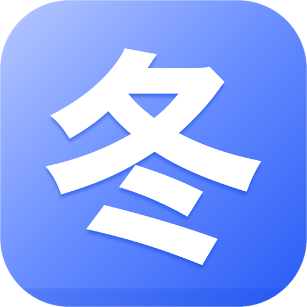
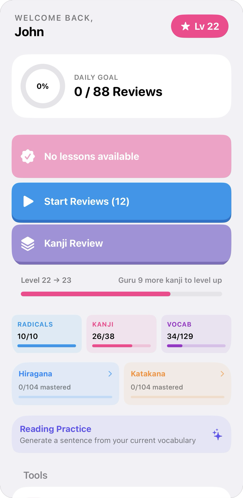
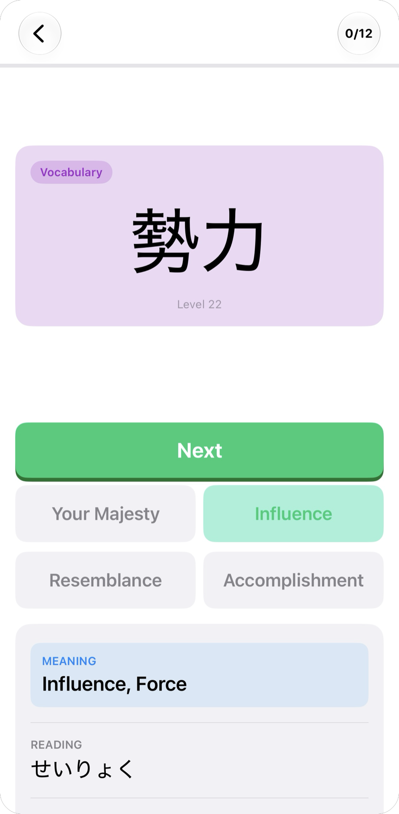
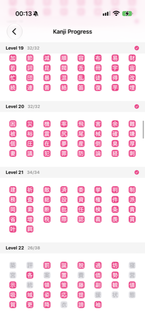

<p align="center">
  
</p>

<h1 align="center">Fuyu</h1>

<p align="center">A faster way to get through your WaniKani reviews.</p>

<p align="center">
  
  &nbsp;&nbsp;&nbsp;&nbsp;&nbsp;&nbsp;&nbsp;&nbsp;
  
  &nbsp;&nbsp;&nbsp;&nbsp;&nbsp;&nbsp;&nbsp;&nbsp;
  
</p>


[WaniKani](https://www.wanikani.com) is a web-based Japanese kanji learning platform that uses spaced repetition (SRS) to teach radicals, kanji, and vocabulary.

The further you progress the easier it is for reviews to pile up, and missing a day might mean you come back to hundreds of reviews waiting. The WaniKani website and mobile web uses keyboard input only and is also strict about what it accepts for answers; exact meanings, particular phrasing for vocabulary, a typo or a close but wrong answer counts as incorrect and every mistake keeps you from progressing. It becomes time consuming and starts to feel impossible to catch up.

Fuyu is an iOS app built to fix that. It swaps the type-in input for multiple choice so there are no typos and you can move through reviews much faster. The goal is  to make it feel more manageable enough that you actually want to sit down and do them. It connects to WaniKani through their official API using your own API key, so your reviews and lessons always pull from your real account and results are submitted back as you go.

---

## Features

### Review session

This is the core of the app and where you'll spend most of your time. Reviews are how your WaniKani progress actually moves forward.

Each item gets two cards, one for meaning and one for reading, because WaniKani only counts an item as correct when you get both right. Miss either and it slips back down its SRS stage, exactly as it would on the site. The two cards are mixed into the queue rather than shown back to back, so answering the reading isn't just recalling the card you saw a second ago.

Each card gives you four choices. After answering you see the correct meaning and reading, any component radicals or kanji, example sentences for vocabulary, and the mnemonic. An item is sent to WaniKani as soon as both of its cards are answered, so leaving halfway through keeps everything you finished.

**Easy Mode** is an optional toggle in Settings that drops the reading card entirely. Kanji and vocabulary become meaning-only, the way radicals already are, and the reading is submitted as correct so your real SRS still advances on the meaning answer alone. It roughly halves the number of cards in a backlog.

### Lesson session

A lesson is where you learn an item for the first time. Rather than being quizzed, you're shown the radical, kanji, or vocabulary word along with its meaning, its reading, how it breaks down into components, and example sentences for vocabulary. Once you move past it, the item is added to your reviews and starts coming back on the SRS schedule.

Items come in the order WaniKani introduces them: lowest level first, and within a level, radicals before kanji before vocabulary. That order matters, because radicals build the kanji and kanji build the vocabulary, so you meet the pieces before the things made out of them.

Each item is sent to WaniKani the moment you tap Next, so you don't have to get through everything in one sitting. Whatever you didn't reach is still waiting as a lesson the next time you come back.

### Kanji Review (practice)

A self-quiz over kanji you've already learned, grouped by SRS stage: Apprentice, Guru, Master, Enlightened, Burned. Pick any combination of categories and the app builds a session of up to 25 kanji from that pool, using the same multiple-choice cards as a real review.

Nothing here is sent to WaniKani. Results don't change your SRS stages, don't count toward your daily goal, and don't consume anything from your queue. It exists mainly for burned and enlightened items, which WaniKani won't show you again but which are exactly the ones that quietly fade.

### Lock Screen widget

An accessory widget for the Lock Screen that cycles through vocabulary you've passed, showing the word, its reading, and its meaning. It changes over the course of the day. Available in both the rectangular and inline families.

The app writes a small word pool into a shared App Group container; the widget reads from that file, so it works with no network access and never touches the app's database. The pool is refreshed on launch and whenever pass status is synced from WaniKani. If you haven't passed any vocabulary yet, it falls back to early-level words.


### Kana practice

A standalone hiragana and katakana practice mode with its own SRS, separate from WaniKani. Each character has a mastery level that goes up as you get it right and drops when you get it wrong. Characters you struggle with show up more often until you've got them down.

### Example sentences

Vocabulary items can show a Japanese example sentence using the target word, with Apple's translation sheet a tap away. Four sources are supported, switchable under **Settings → AI Model**:

| Source | Notes |
|---|---|
| **Pre-generated** | Bundled sentence database indexed by subject ID. Instant, offline, no model required. |
| **Claude API** | Bring your own Anthropic API key. Highest quality; the only one that generates on demand. |
| **Apple Foundation Models** | iOS 26+, on-device, no download. |
| **Qwen2.5-3B** | ~2 GB download, runs fully offline after that. |

Sentences generated by Claude are appended to a writable overlay in Application Support and merged back into the pre-generated pool at read time, so the offline database grows as you use the app.

Generated sentences are built from one of 135 grammar prompts spanning N5 to N1, selected based on your WaniKani level.

> **Note on the local models.** Apple Foundation Models triggers safety guardrails on a large number of vocabulary words, blocking generation entirely. Qwen2.5 produces consistent sentences, but they're often not grammatically correct or natural sounding, and hallucinates to korean for some reason. The pre-generated database was built from larger parameter models to route around both, and is the recommended default.

### Kanji progress

A scrollable grid of every WaniKani kanji grouped by level. Passed kanji are shown in pink; unlearned ones are greyed out. Pass status is synced from WaniKani assignments at launch and updated locally after each review submission.

### Level detail

A breakdown of your current level showing radicals, kanji, and vocabulary grouped into passed, in-progress, and not-started, with each item showing how far along it is in the SRS.

### Offline support

All subjects are stored on your device so the app works even without a connection. On first launch they're loaded from a built-in database of ~9,000 WaniKani subjects. Your account data is refreshed in the background each time you open the app, and a banner lets you know if you lose connection mid-session.

WaniKani periodically reshuffles which level a kanji or vocabulary word belongs to, and retires subjects outright. To keep up, the app pulls whatever has changed since its last sync. That runs once a day in the background, so it's normally a single small request. **Settings → Sync Subjects** forces it and shows when the last one landed.

> **Planned.** Full offline review and lesson support is something we want to add. The idea is to let you complete reviews and lessons normally while offline, save the results locally, and automatically sync everything back to WaniKani once your connection is restored. That way being without internet is never a reason to skip a session.

---

## Tech stack

| Layer | Technology |
|---|---|
| UI | SwiftUI |
| Persistence | SwiftData |
| Widget | WidgetKit + App Group shared container |
| AI (cloud) | Claude API (`claude-haiku-4-5`) |
| AI (on-device) | MLXLLM (Qwen2.5-3B-Instruct-4bit) |
| AI (system) | Apple FoundationModels (iOS 26+) |
| API | WaniKani API v2 |
| Auth | Keychain via Security framework |

Both the WaniKani token and the optional Anthropic key are stored in the Keychain under separate accounts. Neither is ever written to disk in plaintext or bundled with the app.

---

## Data and backup

Everything the app knows lives on your device. There's no account, no server, no analytics, and nothing is sent anywhere except WaniKani's API, and the Claude API if you supply a key.

**There is no iCloud sync.** The app declares no iCloud entitlement and SwiftData runs with a local store, so installing on a second device starts it from scratch. Reviews and lessons stay in step across devices only because they're submitted to WaniKani; anything the app tracks itself does not.

What a nightly iCloud Backup does and doesn't capture:

| Data | Backed up |
|---|---|
| Subject database, kana SRS progress | Yes |
| Claude-generated sentences | Yes |
| Settings, cached user, daily goal | Yes |
| WaniKani and Anthropic API keys | Yes, in the Keychain, encrypted and restorable to a new device |
| Qwen2.5 model (~2 GB) | No, stored in Caches |
| Bundled subject and sentence databases | No, they ship inside the app |

Three consequences worth knowing:

- **Signing out clears this device only.** **Settings → Sign Out** removes the WaniKani token from the Keychain, forgets the cached account, and empties the widget's word pool. Your subjects and kana progress stay, and nothing on WaniKani changes. The Claude key is separate, and you remove it under **Settings → AI Model**.
- **Your kana progress exists nowhere else.** WaniKani has no concept of it, so unlike your SRS stages it can't be re-fetched. iCloud Backup is the only thing protecting it.
- **The Qwen model can vanish.** `Caches` is kept out of backups deliberately, since a 2 GB model has no business in one. iOS may also purge it under storage pressure, in which case it needs downloading again.

---

## Project structure

```
WaniKaniHelper/
├── WaniKaniHelper/
│   ├── WaniKaniHelperApp.swift       — app entry, auth routing, bootstrap, subject and widget sync
│   ├── Models/
│   │   ├── Subject.swift             — CachedSubject SwiftData model
│   │   ├── ReviewItem.swift          — ReviewItem struct, QuestionType enum
│   │   ├── KanaSRSEntry.swift        — KanaSRSEntry SwiftData model
│   │   └── KanjiCategory.swift       — SRS-stage groupings for Kanji Review
│   ├── Services/
│   │   ├── WaniKaniAPI.swift         — API client, all endpoints, response types
│   │   ├── ReviewService.swift       — review session state, Easy Mode, submission
│   │   ├── LessonService.swift       — lesson session state
│   │   ├── KanjiReviewService.swift  — local-only kanji practice, never submits
│   │   ├── KanaReviewService.swift   — kana session state and grading
│   │   ├── KanaData.swift            — static hiragana/katakana tables
│   │   ├── BundledSentenceStore.swift — pre-generated sentence database
│   │   ├── SavedSentenceStore.swift  — writable overlay for newly generated sentences
│   │   ├── SentenceStore.swift       — loads sentences.json for static examples
│   │   ├── SentenceGeneratorService.swift  — AI generation for home card
│   │   ├── ExampleGeneratorService.swift   — AI generation for review/lesson
│   │   ├── PromptLibrary.swift       — selects grammar prompts by user level
│   │   ├── WidgetWordSync.swift      — writes the widget word pool to the App Group
│   │   ├── SubjectBundler.swift      — BundledSubject Codable struct for bundle import
│   │   ├── KeychainService.swift     — API key storage
│   │   ├── DailyGoal.swift           — daily review count, resets at midnight
│   │   └── AI/
│   │       ├── AIBackend.swift       — AIGeneratedContent struct, AIBackend protocol
│   │       ├── AIModelManager.swift  — backend selection and download lifecycle
│   │       ├── ClaudeBackend.swift   — Claude Messages API, BYO key
│   │       ├── MLCQwenBackend.swift  — Qwen2.5 via MLXLLM
│   │       └── AppleFoundationBackend.swift — FoundationModels backend (iOS 26+)
│   ├── Shared/                       — files compiled into BOTH app and widget targets
│   │   ├── WidgetWord.swift          — Codable word struct
│   │   └── WidgetSharedStore.swift   — App Group container read/write
│   ├── Storage/
│   │   ├── SubjectStore.swift        — SwiftData context for WaniKani subjects
│   │   └── KanaSRSStore.swift        — SwiftData context for kana SRS entries
│   ├── Views/
│   │   ├── AuthView.swift            — API key entry and validation, first launch and changes
│   │   ├── HomeView.swift            — dashboard: goal ring, tiles, level progress
│   │   ├── ReviewCardView.swift      — shared quiz card used by both review modes
│   │   ├── ReviewSessionView.swift   — WaniKani review session
│   │   ├── LessonSessionView.swift   — lesson card UI
│   │   ├── KanjiReviewSetupView.swift   — category picker for kanji practice
│   │   ├── KanjiReviewSessionView.swift — kanji practice session
│   │   ├── KanaReviewView.swift      — kana practice UI
│   │   ├── KanjiProgressView.swift   — full kanji grid by level
│   │   ├── LevelDetailSheet.swift    — level breakdown sheet
│   │   ├── DailySentenceCard.swift   — AI sentence card on home screen
│   │   ├── InlineExampleCard.swift   — AI sentence card in lessons and reviews
│   │   ├── SettingsView.swift        — Easy Mode, AI model, API key, sync, sign out
│   │   ├── AIModelSetupView.swift    — backend switching, Qwen download, Claude key
│   │   ├── OfflineBanner.swift       — dismissable network warning banner
│   │   └── SelectableLabel.swift     — UITextView wrapper for selectable Japanese text
│   ├── Prompts/                      — 135 grammar prompt .txt files (N5–N1)
│   ├── sentences.json                — static example sentences
│   ├── wanikani_vocab_sentences.json — pre-generated vocabulary sentences
│   └── subjects_bundle.json          — ~9,000 bundled subjects for offline seed
└── WaniWidget/
    ├── WaniWidgetBundle.swift        — widget extension entry point
    └── LockScreenWordWidget.swift    — Lock Screen vocabulary widget
```

---

## Evolution

The app started as a simple tool for one problem: getting through review backlogs without the friction of typing.

**Core review loop.** The first version pulled your available assignments from WaniKani and showed multiple choice cards for meaning and reading. It worked but was basic. Everything was fetched live on each session start and cards were shown one after another with no mixing.

**Subjects stored on device.** Fetching everything from the API on every launch was slow and hit rate limits fast. All ~9,000 WaniKani subjects were bundled into the app so they load instantly on first launch. After that the app only pulls down what has changed since the last sync.

**Mixed review queue.** The card order was reworked so meaning and reading cards for the same item are spread apart in the queue rather than shown back to back. This feels much closer to how WaniKani actually runs reviews.

**Example sentences.** Vocabulary items gained example sentences to give words more context. These were initially pre-generated and bundled into the app, then expanded with on-device AI generation using Qwen2.5 so any vocabulary word could get a sentence, not just the ones covered by the bundle. Apple Foundation Models was added as an alternative for iOS 26+.

**Lesson mode.** A lesson view was built so you can step through new items before they hit your review queue, the same way WaniKani's lesson system works. Each item is started on WaniKani as you advance through it.

**Kana practice.** Hiragana and katakana practice was added as a standalone mode with its own progress tracking, separate from WaniKani. Characters you struggle with come up more often until you've got them down.

**Kanji progress and level detail.** A kanji grid and level breakdown were added so you can see at a glance what you've passed and where you stand on your current level.

**Better sentences.** Neither local model produced reliably natural Japanese, so the approach changed: a larger model pre-generates sentences for vocabulary offline and they ship as a bundled database. On top of that, a Claude backend was added for anyone who wants to bring their own API key and generate on demand. Anything it generates is saved locally and folded back into the offline pool.

**Kanji Review.** A practice-only quiz mode that lets you drill kanji by SRS stage without touching your WaniKani data. Burned and enlightened items are the main reason it exists; WaniKani considers them finished and never shows them again.

**Easy Mode.** An option to run reviews on meanings alone, for when the backlog is large enough that halving the card count is the difference between doing them and not.

**Lock Screen widget.** A widget extension that surfaces vocabulary you've passed on the Lock Screen, rotating through the day, sharing data with the app through an App Group.

**Polish.** Over time the API key was moved to secure storage, a daily goal ring was added to the home screen, and offline warnings were added for when you lose connection mid-session.

---

## Setup

1. Open `WaniKaniHelper/WaniKaniHelper.xcodeproj` in Xcode 26+
2. Build and run the **WaniKaniHelper** scheme on a device or simulator (iOS 26.4+). The widget extension is embedded in the app, so it installs alongside it. Don't run the `WaniWidgetExtension` scheme directly.
3. Enter your WaniKani API key, which you can find at [wanikani.com/settings/access_tokens](https://www.wanikani.com/settings/access_tokens)
4. Subjects are seeded from the bundled database on first launch, then kept current by the daily background sync described above. No action needed

Example sentences work out of the box from the bundled database. To generate new ones, open **Settings → AI Model** and either paste an [Anthropic API key](https://console.anthropic.com/settings/keys) for Claude, download Qwen (~2 GB), or select Apple Foundation Models on iOS 26+.

To add the Lock Screen widget: long-press the Lock Screen → **Customize** → tap a widget slot → find **Fuyu** → **Vocab Word**. Open the app at least once first so it has words to show.

### Forking

Change the signing team and bundle identifiers to your own in Signing & Capabilities, for every target. The widget's identifier has to stay a child of the app's, e.g. `com.you.WaniKaniHelper` and `com.you.WaniKaniHelper.WaniWidget`.

Then enable **App Groups** on both the app and widget targets and add `group.<your app bundle id>`, matching the app identifier exactly. That naming is what lets the widget find the container without any code change.
